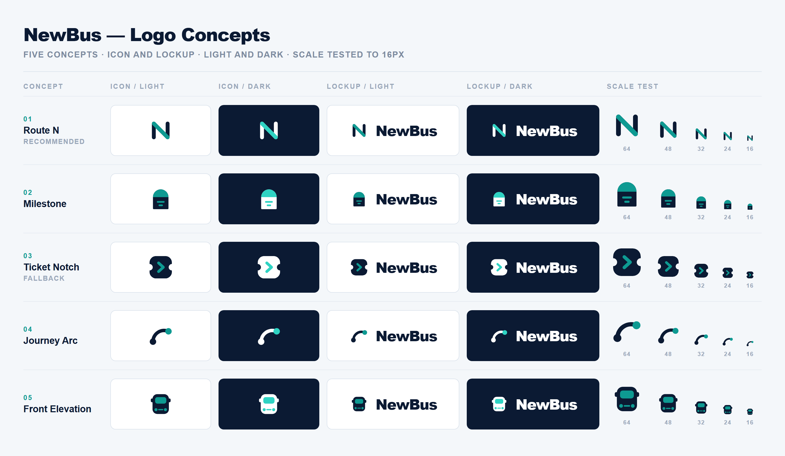

# New Bus

Intercity bus booking platform. React + Vite frontend, FastAPI backend, PostgreSQL.

---

## Brand

Five logo concepts for NewBus, developed from a study of seven competitors --
redBus, AbhiBus, zingbus, IntrCity SmartBus, Fresh Bus, FlixBus and Busbud.



Red and orange are held by the two largest Indian players, green is an EV claim
we cannot back, and purple is IntrCity's. So the palette is **Midnight Navy
`#0B1A33`** with a **Signal Teal `#0E9A92`** accent -- territory nobody in the
category occupies.

**Recommended: 01 Route N.** The letter N drawn as a journey, two uprights as
terminals and the diagonal as the road. It is the only concept meeting all seven
brief criteria at once, and it stays legible at 16px.

| | |
|---|---|
| Full write-up -- research, rationale, per-concept weaknesses | [`brand/NewBus-logo-concepts.pdf`](brand/NewBus-logo-concepts.pdf) |
| Source SVGs -- icon, light and dark | [`brand/concepts/`](brand/concepts/) |
| Palette and file guide | [`brand/README.md`](brand/README.md) |

> Concept stage. Not yet applied to the app -- the header, footer and favicon
> are unchanged pending a decision.

---

## Run it (Docker — recommended)

**Requires:** Docker Desktop, running.

```bash
start.bat                      # Windows
docker compose up -d --build   # any platform
```

First run takes a few minutes to build; later runs are cached. JWT secrets are generated automatically — there is nothing to configure.

| | |
|---|---|
| App | http://localhost:3000 |
| API docs (Swagger) | http://localhost:3000/docs |
| PostgreSQL | `localhost:5433` — user/password/db all `neobus` |

To stop:
```bash
stop.bat                       # Windows
docker compose down            # any platform
```

`docker compose down -v` also deletes the database volume.

---

## First run: load the demo data

The database starts with user accounts but **no cities, routes or trips** — search will be empty until you seed it.

1. Open http://localhost:3000 and log in as `admin@newbus.com` / `password123`
2. Click **Seed Master Data** on the Admin Dashboard

This creates states, cities, routes, operators, buses, seat maps and trips for the next three days.

---

## Demo accounts

All use the password `password123`.

| Email | Role |
|---|---|
| `passenger@newbus.com` | Passenger — starts with a ₹5,000 wallet balance |
| `operator@newbus.com` | Bus operator |
| `support@newbus.com` | Support agent |
| `admin@newbus.com` | Admin |

---

## Run it (dev mode, hot reload)

**Requires:** Node 20+, Python 3.12+, Docker (for PostgreSQL only).

```bash
# 1. Database
docker compose up -d db

# 2. Backend deps — the venv must be at this exact path
cd Neo_bus/backend
python -m venv .venv
.venv\Scripts\pip install -r requirements.txt     # Windows
# .venv/bin/pip install -r requirements.txt       # macOS / Linux

# 3. Frontend deps
cd ../frontend
npm install

# 4. Start both from the repo root
cd ../..
npm run dev
```

| | |
|---|---|
| App | http://localhost:5173 |
| API docs | http://localhost:8000/docs |

`Ctrl+C` stops both processes. A `.env` is created automatically on first start.

To seed from the command line instead of the Admin Dashboard:
```bash
cd Neo_bus/backend
.venv\Scripts\python seed_all_demo.py
```

---

## Tests

```bash
cd Neo_bus/backend
.venv\Scripts\python -m pytest tests -q      # 37 unit + integration tests
```

Smoke-test a running server over HTTP:
```bash
.venv\Scripts\python test_all_apis.py                        # dev mode (:8000)
NEOBUS_API=http://localhost:3000 .venv\Scripts\python test_all_apis.py   # Docker
```

---

## Scope

**Included:** authentication, city/route search, seat selection with concurrency locks, booking and payment, wallet, coupons, ticket and GST invoice PDFs with QR, cancellation and refunds, My Trips, boarding/dropping points, support tickets, operator and admin dashboards, analytics.

**Deferred:** live bus tracking, QR check-in scanning, notification dispatch (push/SMS/email), journey ratings, in-app boarding maps.

---

## Troubleshooting

**Port 8000 already in use** — a previous backend is still running:
```powershell
Get-NetTCPConnection -LocalPort 8000 | Select-Object OwningProcess
Stop-Process -Id <pid> -Force
```

**Search returns nothing** — the demo data has not been seeded. See *First run* above.

**`npm run dev` cannot find Python** — the virtual environment must be at `Neo_bus/backend/.venv`; the launcher looks for it there by path.
